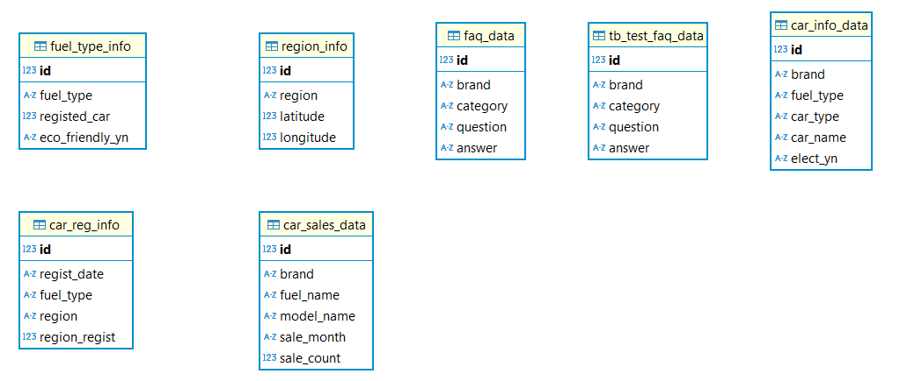

# 👋🏻 팀 소개 👋🏻
## 📌 팀 명
SKN09-1st-2Team : 🌟 2Team 🌟

## 📌 팀 멤버

  :man: 김우중(@kwj9942): Crawling, DB, Streamlit, ReadME, 발표
  
  (개인 깃헙 연동)
  
  :girl: 김하늘(@nini12091): Crawling, DB, Streamlit, ReadME
  
  (개인 깃헙 연동)
  
  :girl: 전성원([@hack012](https://github.com/Hack012)): Crawling, DB, Streamlit, ReadME
  
  
  :girl: 박유진(@YUJINDL01): Crawling, DB, Streamlit, ReadME 
  
  (개인 깃헙 연동)
  

  

## :blue_car: 국내 친환경 자동차(전기 & 하이브리드) 현황 및 데이터 통합 플랫폼 🚗
### 📌 개발 기간
2025.01.07 ~ 2025.01.08 (총 2일)

### 📌 프로젝트 내용
국내 하이브리드 및 전기자동차 등록 현황과 주요 자동차 제조사의 수요데이터를 시각화하고, 전기차 관련 FAQ 정보를 제공하는 플랫폼

### 📌 프로젝트 필요성
- 친환경 자동차 수요 증가

환경 규제와 탄소 배출 감소 노력으로 인해 하이브리드 및 전기 자동차의 수요가 빠르게 증가

- 전기차 선택을 위한 맞춤형 정보 제공

전기차 관련 FAQ와 트렌드 데이터를 통합적으로 제공함으로써 소비자와 관련 업계의 정보 접근성을 높이고, 신뢰할 수 있는 데이터를 기반으로 올바른 선택을 할 수 있도록 지원

### 📌 프로젝트 목표
**전체 목표**
+ 사용자가 데이터를 직관적으로 이해할 수 있도록 통합형 등록 데이터를 시각화 된 이미지로 제공하는 것이다. 
  이를 통해 복잡한 데이터의 해석 용이성 증대, 친환경 자동차에 대한 관심 증진, 실질적인 의사결정 지원을 목표로 함

**세부 목표**

:one: **국내 하이브리드 및 전기 자동차 등록 현황 시각화**
  - 지도 기반 지역별 등록 현황 및 막대 그래프를 통한 자동차별 등록 현황 제공

:two: **국내 주요 5대 자동차 제조사의 수요 현황 분석**
  - 연도별 수요 데이터를 선 그래프로 시각화하고, 하이브리드 및 전기차 수요 비중을 파악

:three: **국내 주요 5대 자동차 제조사의 전기차 관련 통합 FAQ 제공**
  - 전기차에 대한 주요 질문과 답변을 크롤링하여 통합하여 사용자 친화적인 방식으로 제공

### 📌 기술 스택 :chart_with_upwards_trend: 
  :heavy_check_mark: **프론트엔드 및 대시보드** : Streamlit

  :heavy_check_mark: **데이터베이스**: MySQL

  :heavy_check_mark: **데이터 처리 및 분석**: Pandas, Numpy

  :heavy_check_mark: **시각화**: map, plotly, M서

#### :robot: 주요기능
1. **전기차 등록 현황 시각화**
  - 지도(Map) 기반의 지역별 등록 현황 표시
  - bar그래프를 통한 자동차별 등록 현황 비교
  - pie그래프를 통한 화석연료 vs 친환경(전기, 하이브리드) 자동차 비율 비교
2. **주요 5사 수요 현황 분석**
  - 연도별 수요 데이터 트렌드 제공(line 그래프)
  - 하이브리드 및 전기차의 수요 비중(%)시각화
3. **전기차 통합 FAQ 제공**
  - 크롤링을 통해 수집한 자동차 관련 주요 질문과 답변 제공

#### :open_hands: 주요산출물
1. 지역별 및 자동차별 등록 현황 시각화 결과
2. 국내 주요 5사 수요 데이터 분석 그래프
3. 통합된 전기차 FAQ 데이터셋과 검색 인터페이스(검색기능 안돼면 수정 필요)
4. 직관적인 웹 기반 대시보드.

### 📌 데이터베이스 (ERD)

### 📌 프로젝트 수행 결과 (최종 streamlit UI)
차량 소비자 증가 그래프	국산 차량 브랜드 순위
image	image
상위 차량 브랜드의 모델	상위 차량 브랜드 통합 FAQ 조회 시스템
image	image

### 📌 한줄회고
- 김우중:
- 김하늘:
- 전성원: 재미(?)있었습니다.. 🙂
- 박유진: crawling 과 DB 연동을 이용해 streamlit을 구현하면서 프로젝트를 체계적으로 진행하는 순서에 대해 많이 배울 수 있었습니다. 😊 
